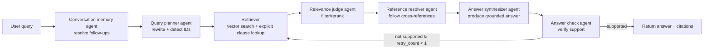

# Multi-agent RAG over FIA 2026 F1 Regulations

End-to-end **text data processing + RAG** over the **2026 FIA Formula 1 regulations**: PDF ingestion, layout-aware OCR to structured JSON, **strike-through cleanup**, **clause-aware chunking**, Pinecone vector search with **BGE embeddings**, and a **LangGraph multi-agent** workflow (plan → retrieve → judge → resolve references → answer → verify) with a **single retry** when evidence is insufficient.

This repo is intentionally built to showcase:
- **Document text processing**: OCR JSON parsing, removing revision strike text, cleaning, normalization
- **RAG understanding**: embedding, vector indexing, retrieval, citation metadata
- **Multi-agent workflows**: stateful graph, specialized agents, validation gates, retry logic

---

## Quickstart (copy/paste)

```bash
python3 -m venv .venv
source .venv/bin/activate
pip install -r requirements.txt

# create .env (see “Environment variables” below)

# 1) OCR PDFs → JSON
python -m src.ocr.paddle_ocr --data-dir data --out-dir data

# 2) (recommended) remove struck-through revision text
python -m src.ocr.remove_strike data

# 3) clause-aware chunking → chunks/*.chunks.jsonl
python -m src.regulations_chunking.run_chunking --input-dir data --output-dir chunks --prefer-no-strike

# 4) embed + upsert to Pinecone
python -m src.regulations_chunking.embed_and_upsert --input-dir chunks --create-index-if-missing --namespace regulations-2026

# 5) advanced multi-agent RAG (CLI)
python -m src.advanced_rag.run --query "What are the shutdown period requirements?" --namespace regulations-2026
```

---

## Data source (PDFs)

Download the official PDFs and place them under `data/`:

| Section | Topic | URL |
|--------|--------|-----|
| **A** | General provisions | [fia_2026_f1_regulations_-_section_a_general_provisions_-_iss_02_-_2026-02-27.pdf](https://www.fia.com/system/files/documents/fia_2026_f1_regulations_-_section_a_general_provisions_-_iss_02_-_2026-02-27.pdf) |
| **B** | Sporting | [fia_2026_f1_regulations_-_section_b_sporting_-_iss_05_-_2026-02-27.pdf](https://www.fia.com/system/files/documents/fia_2026_f1_regulations_-_section_b_sporting_-_iss_05_-_2026-02-27.pdf) |
| **C** | Technical | [fia_2026_f1_regulations_-_section_c_technical_-_iss_16_-_2026-02-27.pdf](https://www.fia.com/system/files/documents/fia_2026_f1_regulations_-_section_c_technical_-_iss_16_-_2026-02-27.pdf) |
| **D** | Financial — F1 teams | [fia_2026_f1_regulations_-_section_d_financial_-_f1_teams_-_iss_05_-_2026-02-27.pdf](https://www.fia.com/system/files/documents/fia_2026_f1_regulations_-_section_d_financial_-_f1_teams_-_iss_05_-_2026-02-27.pdf) |
| **E** | Financial — power unit manufacturers | [fia_2026_f1_regulations_-_section_e_financial_regulations_-_power_unit_manufacturers_-_iss_03_-_2025-12-10_0.pdf](https://www.fia.com/system/files/documents/fia_2026_f1_regulations_-_section_e_financial_regulations_-_power_unit_manufacturers_-_iss_03_-_2025-12-10_0.pdf) |
| **F** | Operational | [fia_2026_f1_regulations_-_section_f_operational_-_iss_06_-_2026-02-27.pdf](https://www.fia.com/system/files/documents/fia_2026_f1_regulations_-_section_f_operational_-_iss_06_-_2026-02-27.pdf) |

---

## How the data is processed

### OCR (PaddleOCR-VL)

- **Entry point**: `src/ocr/paddle_ocr.py`
- **What it produces**: one `*_by_PaddleOCR-VL.json` per PDF
- **Why it matters**: the JSON preserves layout structure (blocks, labels, bounding boxes, reading order) and accurately represents charts/tables, even those with complex cross-grid merged cells, making it much more robust than plain text extraction for regulation PDFs.

Run:

```bash
python -m src.ocr.paddle_ocr --data-dir data --out-dir data
```

### Remove struck-through revision text (PyMuPDF)

FIA PDFs often contain revision markup (magenta strikethrough). If embedding raw OCR blocks, you risk indexing **obsolete** wording.

- **Entry point**: `src/ocr/remove_strike.py`
- **Approach**: reopen the PDF with **PyMuPDF**, detect strike-like vector segments, and rebuild each OCR block from PDF spans/chars while dropping struck content.
- **Output**: `*_by_PaddleOCR-VL_no_strike.json`

Run:

```bash
python -m src.ocr.remove_strike data
```

### Clause-aware chunking (regulation structure)

- **Entry point**: `src/regulations_chunking/run_chunking.py`
- **Core logic**: `src/regulations_chunking/pipeline.py`
- **Output**: `chunks/**/*.chunks.jsonl` with rows shaped like:
  - `text`: embeddable chunk text
  - `metadata`: `article_id`, `appendix_id`, `parent_clause_id`, `page_indices`, `source_file`, etc.

Chunking is **regulation-aware**, not “fixed-size only”:
- groups by **ARTICLE / APPENDIX**
- ignores noisy layout labels (headers/footers/page numbers)
- splits by **clause patterns** (e.g. `E1.2`, `E1.2.1`, lettered sub-items)
- enforces size constraints with overlap

Run:

```bash
python -m src.regulations_chunking.run_chunking --input-dir data --output-dir chunks --prefer-no-strike
```

---

## Advanced RAG design (multi-agent LangGraph + retry)

The advanced assistant (`src/advanced_rag/`) is implemented as a **typed, stateful LangGraph**. Each node is a specialized “agent” that updates a shared state, which makes the pipeline inspectable and easier to iterate on.



Implementation pointers:
- **Graph wiring**: `src/advanced_rag/graph.py`
- **Agent nodes**: `src/advanced_rag/nodes.py`
- **Prompts**: `src/advanced_rag/prompts.py`
- **State schema**: `src/advanced_rag/state.py`

### Evaluation

- **Notebook**: `evaluation.ipynb`
- **Example output**: `eval_basic_vs_advanced_openai.csv`

Questions come from [`test_questions.md`](test_questions.md): markdown lines that start with `*` (bullet list items). The notebook takes the **last 20** such lines (`N_QUESTIONS = 20`). In the current file, those are exactly the bullets under **## Messy / vague user-style questions (keywords not obvious)** (10 prompts with informal wording and non-obvious keywords) and **## Scenario-style questions (test retrieval with indirect wording)** (10 prompts framed as mini-scenarios rather than direct clause lookups)—together they stress **F1 financial / Power Unit–style regulation** QA without spelling out article IDs. The notebook compares **baseline RAG** vs **advanced LangGraph RAG** with an LLM judge, **context-locked fact-check** (claim extraction + verification against each system’s retrieved chunks), combined **final score** (judge score × fact multiplier), and retrieval metrics (**precision@k**, **recall@k**, **MRR** at `TOP_K`, with advanced retrieval scored on **final context** chunks). Re-run the eval cells after changing `TOP_K` or the question set.

---

## File structure (high level)

```text
.
├── data/                          # PDFs + OCR JSON (gitignored except .gitkeep)
├── chunks/                        # Chunk JSONL outputs (gitignored except .gitkeep)
├── frontend/                      # Flask UI (SSE streaming)
│   ├── app.py
│   └── templates/ + static/
├── src/
│   ├── ocr/                       # PaddleOCR-VL + strike cleanup
│   ├── regulations_chunking/      # parse + chunk + embed/upsert
│   ├── rag/                       # baseline RAG scripts
│   └── advanced_rag/              # multi-agent LangGraph assistant
├── requirements.txt
└── evaluation.ipynb
```

---

## How to run (more detail)

### Environment variables

Create a `.env` file in the repo root:

```bash
OPENAI_API_KEY=sk-...
PINECONE_API_KEY=...
PINECONE_HOST=https://your-index-xxxx.svc.region.pinecone.io

# Optional:
# PINECONE_INDEX_NAME=your-index-name
# PINECONE_NAMESPACE=regulations-2026
```

### Embed + upsert

```bash
python -m src.regulations_chunking.embed_and_upsert \
  --input-dir chunks \
  --create-index-if-missing \
  --namespace regulations-2026
```

### Baseline RAG (single-pass)

```bash
python -m src.rag.answer --query "What are the shutdown period requirements?" --namespace regulations-2026
```

### Advanced multi-agent RAG (CLI)

```bash
python -m src.advanced_rag.run --query "Explain the reporting obligations under the cost cap." --namespace regulations-2026
```

### Frontend (Flask + SSE)

```bash
python -m frontend.app
```

Then open `http://127.0.0.1:5000`.

- **How to use (UI)**: type a question, submit, and the page will stream progress phases + the final answer.
- **How to use (API)**:
  - `POST /api/chat` (JSON, non-streaming)
  - `POST /api/chat/stream` (Server-Sent Events, streaming phases + tokens)

Example request body for both endpoints:

```json
{
  "message": "What are the shutdown period requirements?",
  "session_id": "default"
}
```

Notes:
- `session_id` is optional; using the same id enables short follow-up context.
- The streaming endpoint emits events with `type` in `{ "phase" | "token" | "meta" | "error" }` and ends with `[DONE]`.

---

## Troubleshooting

- **`No module named 'paddleocr'`**: install PaddleOCR-VL dependencies or run with the interpreter where `paddleocr` is installed.
- **Nothing retrieved**: ensure you upserted to the same `namespace` you’re querying.
- **Index name confusion**: if you don’t set `PINECONE_INDEX_NAME`, some scripts derive it from the host; explicitly set it to be safe.

---

## References

- Pinecone: [Python client](https://docs.pinecone.io/)
- PaddleOCR-VL: [Hugging Face model card](https://huggingface.co/PaddlePaddle/PaddleOCR-VL)

---

## Future work

One direction is a **search or research agent** layered on top of the current regulation RAG: not for “look up this rule,” but **scenario-grounded questions** that need external or structured facts first, then **tie those facts back to the regulations**. 

Examples: budget or spending questions for a **named team or manufacturer** (e.g. Cadillac), or **hypothetical conduct** for a named person (e.g. “Lewis Hamilton did X under rule Y—would that be penalized?”). The agent would retrieve **scenario-specific information** (news, team pages, sporting summaries, or curated datasets where licensing allows), then **plug distilled facts into the existing clause retrieval** so answers stay anchored to the indexed FIA text while reflecting the user’s concrete situation.
